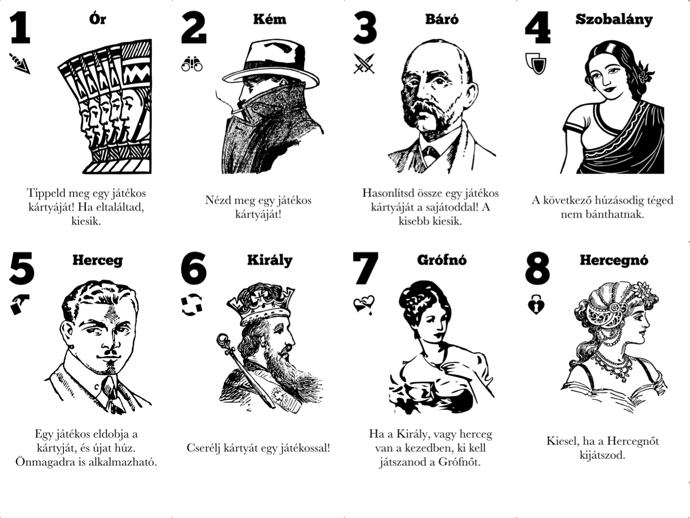

# Love Letter card game

This is my take on the Love Letter card game in Black and White  
Hungarian version  
English version is not available this time but I may do that in the future  



## Requirements for rendering

- Ruby (RVM recommended)
- Squib gem http://squib.rocks
- ChunkFive font https://www.fontsquirrel.com/fonts/chunkfive
- Baskerville font (eg. https://fonts.google.com/specimen/Libre+Baskerville)

## Rendering

```
ruby cards.rb
ruby cardbacks.rb
```

## Acknowledgements

Some of the images or part of the images are from open clipart libraries.


